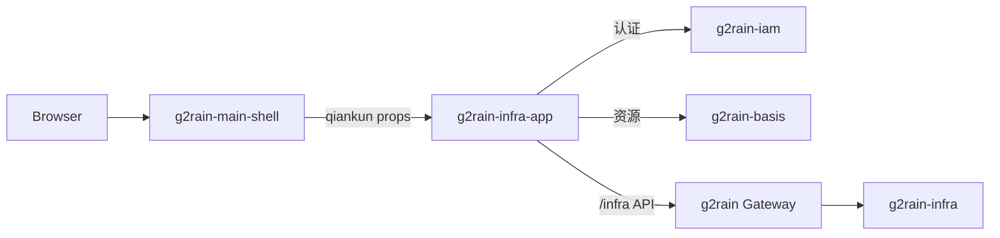

# 架构总览

`g2rain-infra-app` 是 g2rain 前端应用层的基础设施管理子应用，目标采用 `frontend-app 1.0.0`。正式入口由 `g2rain-main-shell` 通过 qiankun 装载；独立模式用于本地开发和诊断。

## 能力范围

- 发号器配置与业务号段标签查询。
- 字典用途及其字典项维护，包括树形字典项。
- 地区语言配置及语言/国家选项查询。
- 国际化消息、用途和 Tag 管理。
- 从 Basis 加载页面、页面元素和 API 资源，形成运行时路由与权限呈现。
- SSO、Token、HTTP DPoP、语言包和 qiankun 生命周期接入。
- 根据 SQL 生成页面骨架，根据静态路由与权限指令生成资源 JSON。

## 组件关系

前端只负责交互和权限呈现；后端认证、权限、租户边界和领域校验仍由 Gateway、IAM 与 `g2rain-infra` 执行。

